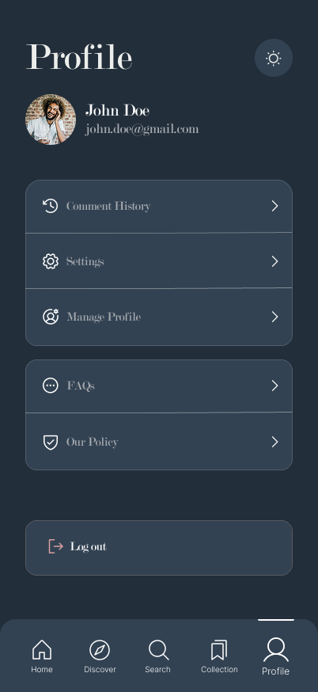

  

# 🚀 Readsy

Ez a projekt egy modern, teljes értékű monorepo architektúrát valósít meg, a **Turborepo** és a **pnpm** segítségével. Célja a type-safe fejlesztés, és a platformfüggetlen hitelesítés biztosítása.

## 📖 Téma

Azért választottuk ezt a témát mert célunk, hogy áthidaljuk a könyvválasztás nehézségeit, és egy olyan felületet biztosítsunk, ahol a felhasználók:

🧭 **Segítenek egymásnak a könyvválasztásban:** A userek ajánlanak és értékelnek, így könnyű megtalálni a következő kedvencet!

🗣️💬 **Ösztönzi a beszélgetést:** Lehet vitatkozni, megosztani a gondolatokat, és mélyebben elmerülni a könyvek világában.

🫂 **Aktív közösséget épít:** Minél több ember csatlakozik, annál több a segítség és az inspiráció!

## 📱 Megjelenés és UI (Showcase)

Az alkalmazás modern, letisztult felülettel rendelkezik, amely mind webes, mind mobil környezetben konzisztens felhasználói élményt nyújt.

### 💻 Webes Felület (React + Vite)

A webes felület a nagy képernyős böngészésre optimalizált, fókuszban a könyvek felfedezésével és az adminisztrációs feladatokkal.

  
  
<i>Főoldal és keresési funkciók a webes platformon</i>

### 🤳 Mobil Alkalmazás (Expo / React Native)

A mobil applikáció az on-the-go olvasóknak készült, gyors hozzáféréssel az értékelésekhez és a közösségi funkciókhoz.

  
  
    
<i>Intuitív mobil felület és keresés nézet</i>

---

## 🌟 Technológiai Stack

| Részleg              | Fő technológia          | Leírás                                                    |
| :------------------- | :---------------------- | :-------------------------------------------------------- |
| **Monorepo Manager** | **Turborepo**           | Gyors buildelés és task futtatás a munkaterületek között. |
| **Csomagkezelő**     | **pnpm**                | Hatékony függőségkezelés szimlinkekkel.                   |
| **Backend**          | **NestJS (Fastify)**    | Skálázható, hatékony szerveroldali alkalmazás.            |
| **Web Frontend**     | **React (Vite)**        | Gyors, modern webes felhasználói felület.                 |
| **Mobil Frontend**   | **React Native (Expo)** | Natív mobilalkalmazások (iOS és Android).                 |
| **Adatbázis ORM**    | **Prisma**              | Type-safe adatbázis-hozzáférés és migrációk.              |
| **Hitelesítés**      | **SuperTokens**         | Session és felhasználókezelés.                            |
| **Séma Validáció**   | **Class Validator**     | End-to-end type-safe adatsémák.                           |
| **Tesztelés**        | **Vitest**              | Megfelelő működés biztosítása backenden.                  |

---

## 📦 Monorepo Struktúra

A projekt a következő kulcsfontosságú munkaterületeket tartalmazza:

| Mappa                       | Leírás                                                                                                                                            |
| :-------------------------- | :------------------------------------------------------------------------------------------------------------------------------------------------ |
| `apps/backend`              | A **NestJS API** a Fastify adapterrel. Felelős a business logika, adatbázis-kommunikáció és a SuperTokens autentikáció szerveroldali kezeléséért. |
| `apps/web`                  | A **React webalkalmazás**, Vite-tel buildelve.                                                                                                    |
| `apps/mobile`               | A **React Native mobilalkalmazás** (Expo-val konfigurálva).                                                                                       |
| `packages/database`         | A **Prisma** konfiguráció (`schema.prisma`), migrációk, és a kliens kód.                                                                          |
| `apps/mobile/.env.example`  | A **.env Fájl** mobilhoz. Felelős a Google passwordless módon való bejelentkezésért.                                                              |
| `apps/backend/.env.example` | A **.env Fájl** backendhez. Felelős a Google kapcsolatokért, az adatbázis, S3 bucket-ek kapcsolatáért.                                            |

---

## 🛠️ Beüzemelés (Local Development)

- Bővebben a beüzemeléséről a projektnek a [SETUP.md fájlban](https://github.com/20HDMI04/End-Term-Project/blob/main/SETUP.md) értekezek.
- Amennyiben szeretnéd hogy az alkalmazás zökkenőmentesen fusson kérlek vedd figyelembe az alkalmazás szükségleteit **.env.example** fájlokban.

## 📚 A projekt erősségei: Type-Safety, Biztonság és Képkezelés

A projekt fő erőssége a **type-safety** :

- **Class Validator:** Az összes bejövő adat validálása DTO-k -on kereszetül történik és a class validátor biztosítja.
- **Prisma Kliens:** A **`@repo/database`** csomag egy megosztott Prisma klienst és típusokat exportál, így a backend kódja mindig típusbiztosan kommunikál az adatbázissal.
- **Interceptorok:** Az S3 bucketekben elhelyezhető képek típusbiztonságát saját kézzel megírt fájl interceptorok biztosítják ezáltal nem kerülhetnek más fájlok a bucket-ekbe csak amit mi megszabunk pl.: jpg, png .

Ezek mellet a projekt fő célja volt még a magas fokú biztonság is ezt **SuperTokens**-el valósítjuk meg:

- **RBAC:** A projekt részét képezi a Role Based Authentication melynek segítségével a userek között különbségeket tudunk tenni admin és sima userek között.
- **Rotating Tokens:** A felhasználó maximális kényelme érdekében session alapú a token kezelés ezért automatikusan frissíti a tokent ha lejárt. Ezenkívül ha bármelyik munkamenet korruptálódik a SuperTokens biztosít arról hogy megmaradjon a teljes biztonság mindezt úgy hogy leállítja az összes munkamenetet és újra be kell jelentkezni.

**Képkezelés** S3 bucket-okkal:

- **Seeding:** Ahhoz hogy könnyű legyen az S3 setupolása van előre megírva egy init bash script amely létrehozza a permission-öket, a vödröket amelyben tároljuk a képeket és a default képeket is betölti amelyek biztosítják hogy az alkalmazás és könyvek mindenképpen kapjanak egy filler képet.
- **Kép feltöltés:** A kép feltöltés az alkalmazás gyors betöltése érdekében sharp könyvtárat használva butítva vannak ezáltal a képek minősége kisebb lesz de viszont a betöltési idő növelve lesz.
- **Ingyenes opció:** Mivel szerettünk volna egy olyan projektet ahol szinte semmiért maximum az üzemeltetésért kelljen fizetni úgy gondoltuk hogy a localstack-et használjuk mely biztosít számunkra egy AWS instance-t amely ezáltal lehet egy olcsóbb megoldást biztosít és megadja a biztonságot abból a szempontból hogy az adatok a mi szervereinken helyezzük el.

## ✨ Főbb Funkciók

A projekt közösségi platform a következő, felhasználói élményt növelő funkciók lesznek beépítve:

1.  ⭐️ Értékelés és Véleményezés
    Ez a funkció teszi a platformot igazán közösségivé és interaktívvá.
    - Rendszer: A felhasználók 1-től 5 csillagig terjedő skálán értékelhetik a könyveket.
    - Vélemény hozzáadása: Lehetőség nyílik szöveges vélemény írására is, ami segíti a többi olvasót a választásban és ösztönzi a diskurzust.
    - Átlagolás: Az egyes könyvek adatlapján megjelenik a felhasználói értékelések átlaga, mint megbízható minőségi mutató.

2.  🔍 Intelligens Keresés
    A gyűjteményben való hatékony navigáció kulcsfontosságú.
    - Többdimenziós szűrés: A keresés nem csak a címre vagy szerzőre korlátozódik. Kereshetünk akár bio vagy description alapján is.

    - Gyors válasz: A beépített keresőmotor azonnali eredményeket szolgáltat gépelés közben.

    - Cél: Gyorsan és pontosan megtalálni a keresett könyveket, még a növekvő adatbázisban is.

3.  🛡️ Adminisztrációs Oldal (Admin Panel)
    A tartalom és a felhasználói közösség kezelésére szolgáló központi irányítópult.
    - Könyvek kezelése: Az adminok hozzáadhatnak, szerkeszthetnek vagy eltávolíthatnak könyveket az adatbázisból.

    - Felhasználók felügyelete: Jogosultságok kezelése (pl. moderátorok kinevezése), vagy felhasználók felfüggesztése a közösségi irányelvek megsértése esetén.

    - Tartalom moderálása: A nem megfelelő könyvek és szerzők áttekintése és törlése, ezzel biztosítva a magas minőségű tartalmat.

## 🧪 Minőségbiztosítás és Dokumentáció

A projekt hosszú távú fenntarthatóságát és a fejlesztői élményt (DX) modern eszközökkel biztosítjuk.

### ✅ Tesztelési Stratégia

A stabilitásért a **Vitest** felel, amely villámgyors visszacsatolást ad a fejlesztés során.

- **Unit Teszt fókusz:** A logika nagy részét izolált egységtesztek fedik le, biztosítva a szolgáltatások (services) és segédfüggvények helyes működését.
- **Prisma Mocking:** Az adatbázis-műveleteket a tesztek során mockoljuk, így nincs szükség futó adatbázisra a teszteléshez, ami konzisztens és gyors futtatást tesz lehetővé.
- **Type-safe tesztelés:** A TypeScript szoros integrációjával a mockolt adatok is követik a sémákat.

---

### 📄 Dokumentációs Rendszer

A projekt két szinten dokumentált, hogy mind a külső integráció, mind a belső fejlesztés gördülékeny legyen:

1.  **API Dokumentáció (Swagger/OpenAPI):**
    - A NestJS és Fastify alapokon nyugvó backend automatikusan generált, interaktív felületet biztosít.
2.  **Kód-szintű Dokumentáció (TypeDoc):**
    - A forráskód belső összefüggéseit, az osztályokat és az interfészeket a TypeDoc segítségével dokumentáljuk.

> **ℹ️ Megjegyzés:** A tesztek futtatásához és a dokumentáció generálásához szükséges parancsokat a [SETUP.md](./SETUP.md) tartalmazza.

## 📄 További dokumentációk

- Bővebben az [Architektúránkról](https://github.com/20HDMI04/End-Term-Project/blob/main/documentation/overview.md)
- Bővebben a projekt [SETUP](https://github.com/20HDMI04/End-Term-Project/blob/main/SETUP.md)-olásáról
- Bővebben a mobilhoz tartozó [User Story](https://github.com/20HDMI04/End-Term-Project/blob/main/documentation/mobile_user_story.md)-ról

## 👤 Tagok

[Hegedűs Péter](https://github.com/LepkefingLeo) 
[Balogh János Péter](https://github.com/20HDMI04) 
[Szalontai Csekő](https://github.com/Cs3k0)
